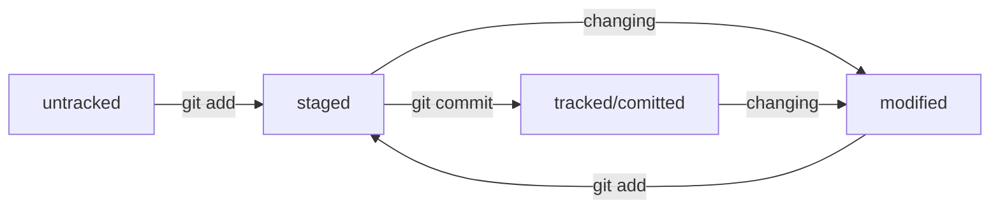

# Шпаргалка по git

Git - система контроля версия, используется для синхронизации изменений в проекте.

## Перечень основных команд

+ git init - создание локального репозитория в текущей директории
+ git status - отображение статуса локального репозитория
+ git add 'modified files' - добавление файлов которые git будет отслеживать
  > Для добавления всех файлов опция --all или .
+ git commit -m 'Your commit'- фиксация изменений с обязательным комментированием
  > Чтобы открыть редактор для комита, убраьт опцию -m
+ git checkout *branch* - переключение на другую ветку
  > Опция -b для создание ветки, если таковая не существует
+ git remote add *origin* url - связать локальный репозиторий с удаленным
  > origin  стандартный псевдоним, с помощью которого можно обращаться к главному удалённому репозиторию (обычно такой репозиторий один). Это значительно упрощает работу.
+ git remote -v - убедиться, что репозитории связаны
+ git push *origin* *branch* - залить изменения на удаленный репозиторий на выбранную ветку
  > origin  стандартный псевдоним, с помощью которого можно обращаться к главному удалённому репозиторию (обычно такой репозиторий один). Это значительно упрощает работу.

+ git push *origin* *branch* - залить изменения в удаленный репозиторий на выбранную ветку
+ git pull *origin* *branch* - синхронизировать содержимое локального репозитория с удаленным с выбранной ветки
+ git branch -C *branch* - создание новой ветки
  > Для перемещения ветки (изменения ее имени) -M
+ git clone *URL*- клонировать репозиторий на локальную машину
+ git log - просмотр логов изменений

## Как гид хранит изменения

Git хеширует информацию о коммите с помощью алгоритма SHA-1 и получает для каждого коммита свой уникальный индификатор — хеш.
Хеш — основной идентификатор коммита и позволяет узнать его автора, дату и содержимое закоммиченных файлов.
Все хеши, а также таблицу соответствий `хеш → информация` о коммите Git хранит в папке .git

В числе прочих файлов в папке .git есть служебный файл HEAD. Он указывает на самый свежий коммит. Вместо хеша последнего коммита можно написать слово HEAD — Git вас поймёт.

## Работа с логами

Можно вызвать не только полный лог, но и сокращённый — `git log --oneline`.
В сокращённом логе выводятся сокращённые хеши — их можно использовать точно так же, как и полные.

## Расшифровывание git status

Есть несколько состояний в которых может находится файл:

+ untracked - файл не отслеживаеться
+ tracked - файла отслеживается
+ staged - в это состояние файла поподает после `git add`
+ modified - файл был изменен

### Жизненый цикл состояний файла

## Как писать комиты

Есть несколько стилей/соглашений как писать комиты. Главные принципы - это информативность, и длина комита (не должна преывашать 72 символа) для удобства восприятия.
Пример комита: `git commit -m "Добавить подсчёт суммы заказов за неделю"`
GitHub можно использовать не только для хранения файлов проекта, но и для ведения списка задач (англ. issue) этого проекта. Если коммит «закрывает» или «решает» какую-то задачу, то в его сообщении удобно указывать ссылку на неё. Для этого в любом месте сообщения нужно указать #<номер задачи>. Например, вот так: `git commit -m "Исправить #334, добавить график температуры"`

## Как исправить commit

Флаг `--amend`.

+ `--amend` рассчитан на работу с последним коммитом (`HEAD`).
+ Дополнить коммит новыми файлами можно с помощью `git commit --amend --no-edit`. Благодаря опции `--no-edit` сообщение к коммиту останется таким, каким и было.
+ Изменить сообщение к коммиту позволяет команда `git commit --amend -m "Обновлённое сообщение коммита"`.

## Как откатиться назад, если «всё сломалось»

+ Команда `git restore --staged <file>` переведёт файл из `staged` обратно в `modified` или `untracked`.
+ Команда `git reset --hard <commit hash>` «откатит» историю до коммита с хешем `<hash>`. Более поздние коммиты потеряются!
+ Команда `git restore <file>` «откатит» изменения в файле до последней сохранённой (в коммите или в staging) версии.

### Выполнить unstage изменений

`git restore --staged <file>` (возвращает все файлы из stage обратно в untracked/modified)

### «Откатить» коммит — `git reset --hard <commit hash>`

![[Pasted image 20231216165437.png | 700]]
После `git push -f origin <branch>`

### «Откатить» изменения, которые не попали ни в staging, ни в коммит, — `git restore <file>`

Изменения в файле «откатятся» до последней версии, которая была сохранена через `git commit` или `git add`.

# Просматриваем изменения в файлах

